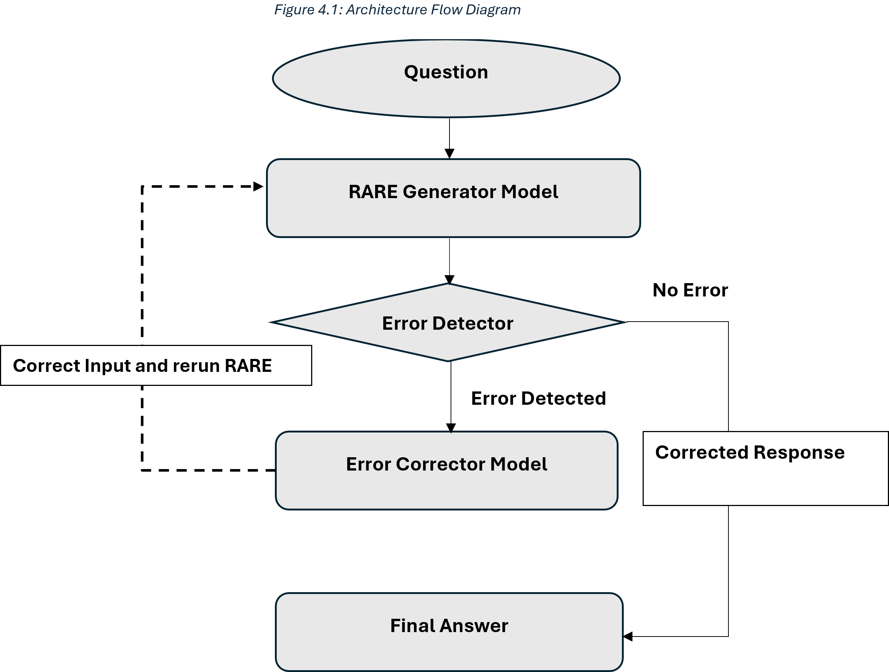

# Model Card: Self-Correcting RARE for Biomedical QA

## Overview

- Name: Self-Correcting RARE (Retrieval-Augmented Reasoning Engine)
- Task: Biomedical question answering with evidence-grounded reasoning, error
  detection, and self-correction.
- Components: Llama-3.1-8B with LoRA generator; SciBERT error detector; Flan-T5
  corrector; SentenceBERT with FAISS retriever.
- Status: Research prototype (master's thesis, EPITA, 2025).

## Intended use

Intended for research and education on retrieval-augmented reasoning,
hallucination mitigation, and self-correction in biomedical NLP.

Not intended for clinical decision-making, diagnosis, treatment guidance, or any
use where a person relies on the output for a health decision. The system is not
a medical device and has not been clinically validated.

## Training data

- Source: PubMedQA (treatment and mechanism subset). Contexts were deduplicated
  into a retrieval corpus.
- Split: 1,800 training samples, 200 validation samples.
- Derived datasets: error-detection and self-correction training data were
  generated automatically from RARE outputs, labeled by overlap with reference
  answers.

## Evaluation

Measured per pipeline component:

| Component | Metric | Score |
|---|---|---|
| RARE generator | BERTScore F1 | 0.781 |
| RARE generator | ROUGE-L F1 | 0.342 |
| Error detector | Accuracy | 0.873 |
| Error detector | F1 | 0.830 |
| Self-corrector | BERTScore F1 | 0.825 |
| Self-corrector | ROUGE-L F1 | 0.298 |
| Self-corrector | BLEU | 0.074 |

The error detector is the strongest component, with 0.873 accuracy and 0.830 F1,
performing the safety-critical task of flagging likely-incorrect answers.
BERTScore values in the 0.78 to 0.83 range indicate strong semantic alignment
with reference answers. ROUGE-L and BLEU are low, which is expected for
generative QA that produces explanatory answers rather than copying reference
text, and which also indicates room to improve the generator.

## Limitations

- Generator training was limited. Training ran for under one epoch on a small
  subset, with a training loss reduction of approximately 5.6 percent. The
  generator is undertrained, and its standalone factual accuracy is limited. The
  error detector and corrector exist to compensate for this.
- Not clinically validated. No evaluation against clinical outcomes or by medical
  professionals.
- Hallucination is reduced but not eliminated. Retrieval and self-correction
  lower the risk of confident, incorrect answers but do not remove it.
- No bias or fairness evaluation across patient populations was performed.
- Coverage is limited to the topics and style of the training subset.
  Out-of-distribution questions may degrade without warning.
- The retrieval corpus is finite. Questions outside it are answered from
  parametric knowledge with weaker grounding.

## Ethical and compliance notes

The application layer anonymizes PHI before processing and logs session-level
audit events (HIPAA-aware). This addresses data-handling concerns but does not
constitute a risk-management, bias-testing, or post-market-monitoring program.
Deployment in a regulated setting, such as under the EU AI Act high-risk
requirements, would require additional governance, testing, and documentation
beyond what this prototype provides.

## Origin

Master's thesis, Self-Correcting RARE for Biomedical Question Answering, EPITA
Graduate School of Computer Science, 2025. Baseline RARE generator by Abubakar
Aliyu. Full framework developed by a four-person team, advised by Alaa Bakhti.
